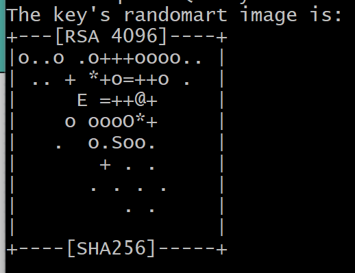
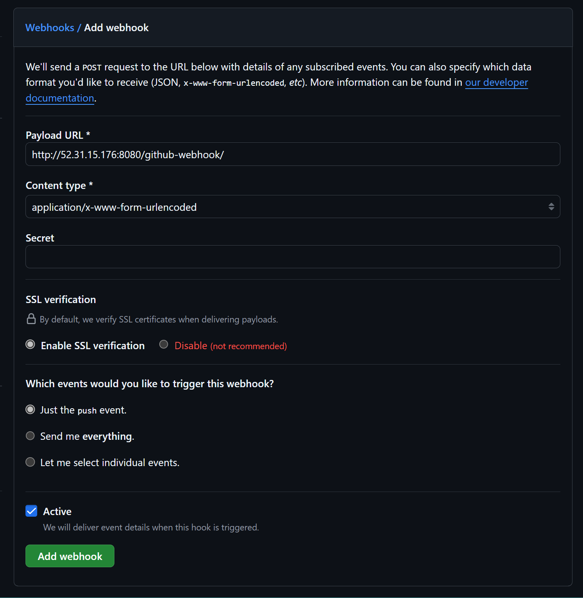
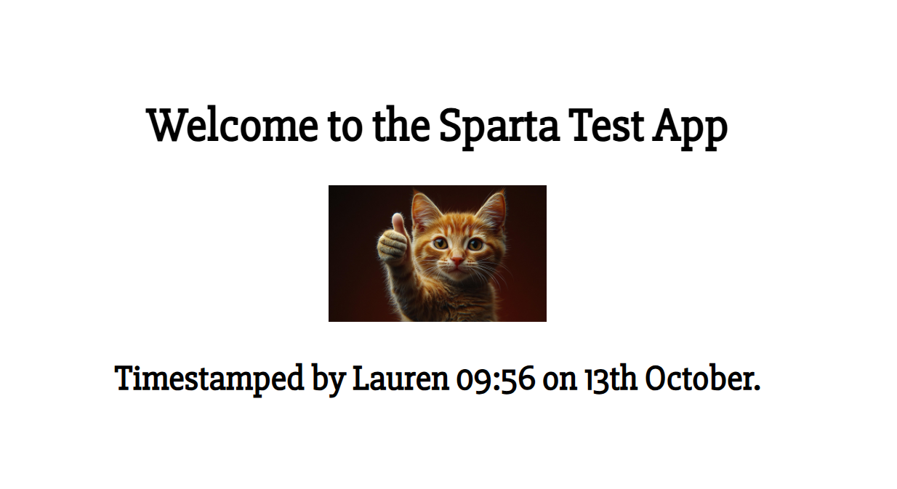
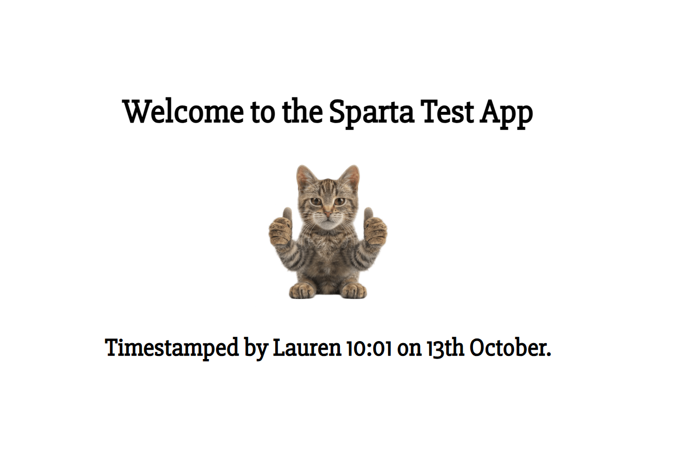
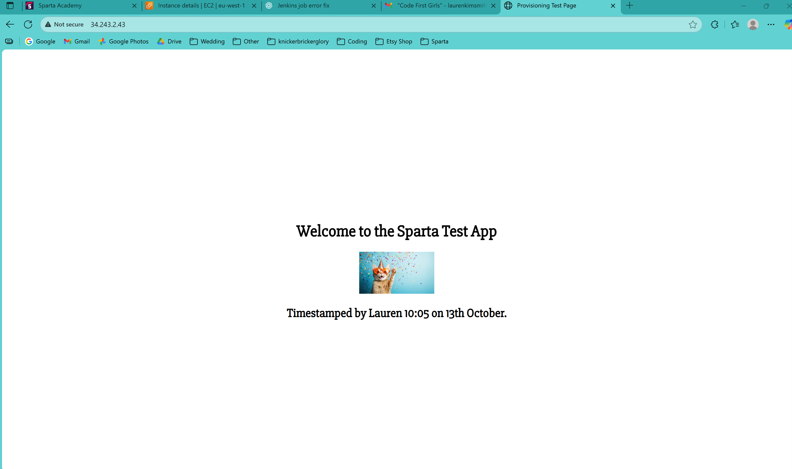

# CI/CD With Jenkins

- [CI/CD With Jenkins](#cicd-with-jenkins)
  - [Intro to CI/CD and Jenkins](#intro-to-cicd-and-jenkins)
    - [What is CI? Benefits?](#what-is-ci-benefits)
      - [What is CI?](#what-is-ci)
      - [Benefits?](#benefits)
    - [What is CD? Benefits?](#what-is-cd-benefits)
      - [What is CD?](#what-is-cd)
        - [\* Continuous Delivery](#-continuous-delivery)
        - [\* Benefits?](#-benefits)
        - [\* Continuous Deployment](#-continuous-deployment)
        - [\* Benefits?](#-benefits-1)
    - [Benefits of CI/CD Pipeline](#benefits-of-cicd-pipeline)
    - [What is Jenkins?](#what-is-jenkins)
    - [Why Use Jenkins? Advantages of Using? Disadvantages?](#why-use-jenkins-advantages-of-using-disadvantages)
      - [Advantages](#advantages)
      - [Disadvantages](#disadvantages)
  - [Stages of Jenkins for a CI/CD Pipeline](#stages-of-jenkins-for-a-cicd-pipeline)
  - [What Alternatives Are There for Jenkins?](#what-alternatives-are-there-for-jenkins)
  - [Why Build a Pipeline? Business Value?](#why-build-a-pipeline-business-value)
  - [Diagram Showing How Our CI/CD Pipeline on Jenkins Works](#diagram-showing-how-our-cicd-pipeline-on-jenkins-works)
  - [Jenkins Pipeline to Deploy Sparta Test App](#jenkins-pipeline-to-deploy-sparta-test-app)
    - [Step 1: Create a New SSH KeyPair](#step-1-create-a-new-ssh-keypair)
    - [Step 2: Create a New Repo on Github and Add Public Key](#step-2-create-a-new-repo-on-github-and-add-public-key)
    - [Step 3: Add App Directory To Your New Repo](#step-3-add-app-directory-to-your-new-repo)
    - [Step 4: Jenkins: Job 1 - CI Test](#step-4-jenkins-job-1---ci-test)
    - [Step 5: Webhook](#step-5-webhook)
    - [Step 6: Add Webhook to Jenkins](#step-6-add-webhook-to-jenkins)
    - [Step 7: Dev Branch on Local Git Repo](#step-7-dev-branch-on-local-git-repo)
    - [Step 8: Jenkins: Job 2 - Tests on Job 1 Passed, Job 2 Runs and Merges Dev to Main Branch](#step-8-jenkins-job-2---tests-on-job-1-passed-job-2-runs-and-merges-dev-to-main-branch)
    - [Step 9: AWS: Create An EC2 Instance](#step-9-aws-create-an-ec2-instance)
    - [Step 10: Jenkins: Job 3 - Part 1: Copy App To EC2 Instance Using SCP](#step-10-jenkins-job-3---part-1-copy-app-to-ec2-instance-using-scp)
    - [Step 11: Jenkins Job 3 - Part 2: SSH Into EC2 Instance and Run The App](#step-11-jenkins-job-3---part-2-ssh-into-ec2-instance-and-run-the-app)
  - [My Take On Why We Did This and The Benefits of CI/CD (For Myself as well as the Home Office)](#my-take-on-why-we-did-this-and-the-benefits-of-cicd-for-myself-as-well-as-the-home-office)
    - [Why I Did This](#why-i-did-this)
    - [Benefits for Me](#benefits-for-me)
    - [Benefits for the Home Office](#benefits-for-the-home-office)
    - [Troubleshooting](#troubleshooting)
      - [💥*Issue 1: “Permission denied (publickey)” when running Job 2*](#issue-1-permission-denied-publickey-when-running-job-2)
      - [💥 *Issue 2: "Syntax error: Unterminated quoted string"*](#-issue-2-syntax-error-unterminated-quoted-string)
      - [💥 *Issue 3: “Bad substitution”*](#-issue-3-bad-substitution)
      - [💥 *Issue 4: “scp: error: unexpected filename: .”*](#-issue-4-scp-error-unexpected-filename-)
      - [💥 *Issue 5: “Could not read package.json”*](#-issue-5-could-not-read-packagejson)
      - [💥 *Issue 6: “npm ci can only install packages when your package.json and package-lock.json are in sync”*](#-issue-6-npm-ci-can-only-install-packages-when-your-packagejson-and-package-lockjson-are-in-sync)
      - [💥 *Issue 7: “Failed to connect to localhost port 3000”*](#-issue-7-failed-to-connect-to-localhost-port-3000)
  - [Troubleshooting Log — **Job 3: CD (Deploy to EC2)**](#troubleshooting-log--job-3-cd-deploy-to-ec2)
    - [TL;DR (Final Working Recipe)](#tldr-final-working-recipe)
    - [Jenkins Settings That Mattered](#jenkins-settings-that-mattered)
    - [Chronological Troubleshooting](#chronological-troubleshooting)
      - [💥 1) Copy-artifacts confusion](#-1-copy-artifacts-confusion)
      - [💥 2) First `scp` + `npm start` attempts](#-2-first-scp--npm-start-attempts)
      - [💥 3) **Nested folder**: `app/app`](#-3-nested-folder-appapp)
      - [💥 4) `Permission denied (publickey)`](#-4-permission-denied-publickey)
      - [💥 5) `scp` copying nothing / wrong path](#-5-scp-copying-nothing--wrong-path)
      - [💥 6) `rsync: change_dir ... No such file or directory`](#-6-rsync-change_dir--no-such-file-or-directory)
      - [💥7) `npm ci` error (no `package-lock.json`)](#7-npm-ci-error-no-package-lockjson)
      - [💥 8) `scp: error: unexpected filename: .`](#-8-scp-error-unexpected-filename-)
    - [💥 9) Empty host in SSH/SCP](#-9-empty-host-in-sshscp)
    - [💥 10) Final stable deploy flow](#-10-final-stable-deploy-flow)
  - [Screenshots of Timestamped 'Proof It Worked' Front Pages](#screenshots-of-timestamped-proof-it-worked-front-pages)
  - [Quick Checklist (When Things Break)](#quick-checklist-when-things-break)
  - [Why this took more steps than others](#why-this-took-more-steps-than-others)

## Intro to CI/CD and Jenkins

### What is CI? Benefits?

#### What is CI?
* Continuous Integration.
* Triggered by:
  * Developers who are frequently pushing their code changes to a shared repository 
* Tests are automatically run on the updated (pushed) code
  * If the tests pass, the updated code gets integrated /merged with the main code base.

#### Benefits?
* Helps to quickly identify and resolve integration bugs early
  * This reduces cost and complexity of project management
* Helps maintain a stable and functional software build

### What is CD? Benefits?

#### What is CD?
* Continuous Delivery or Continuous Deployment
##### * Continuous Delivery
  * The software is always in a deployable state and CAN be pushed into production at any time
  * Often involves producing a deployable artefact
  * Used when we want manual, human intervention PRIOR to deployment; a human to make a decision on releasing that software

##### * Benefits?
    * Always have stable/functional software ready to deploy

##### * Continuous Deployment
  * Usually still produces a deployable artefact, but also automatically deploys it, often to production

##### * Benefits?
  * Removal of human approval, so deployment is automated and therefore much quicker

### Benefits of CI/CD Pipeline
  * Without CI/CD pipeline, miss out on user input/feedback, which creates value for the organisation. Because of how much quicker the process is with a CI/CD pipeline, gets to user sooner therefore adding value

### What is Jenkins?

* An open-source automation server
* Primarily used for CI/CD, but can automate much more

### Why Use Jenkins? Advantages of Using? Disadvantages?

#### Advantages

* Automation of CI/CD helps to avoid human error and reduce manual intervention
* Extensibility:
  * Over 1800+ plugins to support variety of tools and programming languages
* Scalability:
  * Can add nodes/agents to handle jobs/projects that need to be run
* Community support
* Customisation
* Cross-platform e.g. Windows, Linux, MacOS

#### Disadvantages

* Can be complex for beginners
* Maintenance overhead
* GUI interface - not so modern?

## Stages of Jenkins for a CI/CD Pipeline

1. Source Code Management (SCM)
2. Build e.g. compile the code
3. Test
4. Package
5. If Continuous Deployment, then deploy
6. Monitor
   * setting up/integrating the application with monitoring/logging tools

## What Alternatives Are There for Jenkins?

* GitHub Actions
* GitLab CI
* CircleCI
* Travis CI
* Bamboo
* TeamCity
* GoCD
* Azure Pipelines

## Why Build a Pipeline? Business Value?

* Faster time to market
* Improved quality of software by catching bugs earlier
* Productivity of developers:
  * They concentrate on writing the code

## Diagram Showing How Our CI/CD Pipeline on Jenkins Works


## Jenkins Pipeline to Deploy Sparta Test App

### Step 1: Create a New SSH KeyPair
* In Git Bash, cd into your .ssh folder on your local machine
* Run this command: <br>
  `ssh-keygen -t rsa -b 4096 -C "<your **GitHub** email address>"` <br>
* You will be prompted to enter file in which to save the key (in other words, name of the file). Ensure that this name is purposeful for future use - if you have multiple key pairs, how will you know what each pair is for? For example, my key pair name for this was:<br>
  `lauren-jenkins-to-github-key`<br>
* Once you press enter, you will be asked to enter a passphrase for this keypair. If you don't need one (we didn't use one), simply press enter. You will then need to either enter the passphrase again, or - if not using one - again simply press enter.
  <br> <br>

* In Bash, you should now see a message along with your key's randomart image, something like:
<br><br>

* When you run `ls` in your .ssh folder now, you should see 2 new files with your name: one without a . at the end, and one with .pub at the end (the former is your private key and the latter your public key).
* Run the command:<br>
  `cat <name of your PUBLIC key>`
* You should now see your public key on your screen.
**NB**: Your public key should begin with ssh-rsa and end with your email address. DO NOT LEAVE ANY CHARACTERS OUT. You will need this for step 2.

### Step 2: Create a New Repo on Github and Add Public Key
* Go to your Github homepage and create a new repo.
* Add the app folder and README.md file to this new repo. Ensure you have it at the root level, not within another folder.
* Now, go to the settings tab **for this repo**, not for your GitHub overall. This is found on the top tab next to 'Insights'.
* On the left hand menu that runs down within your settings, go to the security section and click on 'Deploy keys'.
* Click the green 'Add deploy key button'
* Title: For consistency/ease of use, give it the **same** name as your key pair.
* Key: Here, you are going to paste your **entire** public key. Double check that you don't leave anything out!
* Tick 'Allow write access' then the green 'Add key' button. You may be asked for your password on the next screen (2-factor authentication).

### Step 3: Add App Directory To Your New Repo
* Using Git Bash, I first cloned my new repo from GitHub to my  local machine. 
* Then, I copied the app folder (and README.md file) into my local repo. 
* After that, I staged my changes, committed and pushed them to my GitHub repo.
* Finally, I checked my GitHub repo to ensure that they were there.

### Step 4: Jenkins: Job 1 - CI Test
* Once I was logged onto Jenkins, I clicked '+ New Item' near the top on the left-hand menu, to add a new project (job).
* From there, I gave my 'item' a name (lauren-job1-ci-test) and added a description about the job (running tests on the app code).
* Next, under discard old builds, I chose to keep a maximum of 5 old builds.
* I needed to tick 'GitHub' project, so that Jenkins could access GitHub and the app repo.
  * Go to your GitHub repo (with the app folder) and click on the green 'code' button. From there, get the https link. 
  * Paste this into the project url on Jenkins, *however* ensure you remove the `.git` from the end of the link and replace it with `/`.
* Then, I needed to add Git under Source Code Management.
  * Change 'None' to 'Git'.
  * Go back to your GitHub repo and the green 'code' button, but this time, get the SSH link.
  * Paste this link in the 'Repository URL' box. This time, leave it exactly as it is, with `.git` on the end.
  * **Don't panic** when you see the angry red message below; it is simply waiting for your private key so that it can access your repo!
    * To do this, go to Credentials and if you are doing this for the first time, click on 'Add' and then 'Jenkins', which will be your only option.
    * Leave Domain as-is, but change 'Kind' to 'SSH Username with Private Key'.
    * Leave Scope as-is.
    * For ID (and username), add the same name as the name you gave your [keypair](#step-1-create-a-new-ssh-keypair) earlier, in your .ssh folder.
    * Ensure the description is purposeful, so it is useful in the future, such as 'to read/write to the app repo'.
    * Leave 'Treat username as secret' unchecked.
    * Then, under 'Private Key', select 'Enter directly' and then add the entire contents of your **PRIVATE** key file (use the same method to cat it to your Bash screen, BUT ensure you select your private key and not the public one! You will know it is the correct one if it starts with 5 hyphens in a row).
    * **Double check** that you have the entire private key - include all 20 hyphens!
    * Leave 'Passphrase' blank and click 'Add'.
* Go to 'Branches to build' and specify main **if** the 'main' branch of your GitHub repo is called main - check!
* Under Build Environment, tick 'Provide Node & npm bin/ folder to PATH.
  * NodeJS Installation - NodeJS version 20
  * Leave npmrc file and Cache location as-is.
* Under 'Build Steps', click add build steps and select 'Execute Shell', which opens a shell for your commands.
* For our app project/job, we added the following commands:
      ```
      cd app
      npm install
      npm test
      ```
* Click 'save'.
* Now, you should see the option to 'Build Now'. Click that. 
* To see if it has worked, you can either go back to the Dashboard, or watch from this screen. When it is finished, whether it has been successful or not, you can click on the date/title of this build under 'Build History', which shall open a new menu where you can go to 'Console Output' and see what has been done, or what errors occured.
<br><br>
### Step 5: Webhook
* Go to your GitHub repo
* Go back to your repo settings
* Go to webhooks on the left hand menu
* Click 'Add webhook'
* You may be asked to confirm access on the next screen
* On the following screen, you shall see 'Payload URL'. You want to send this to Jenkins, so you need to use your Jenkins server's IP address and port, which should be in the address bar (ensure you take the IP AND Port). At the end of this, add a forward slash and github-webhook and a final forward slash. It should look something like this: <br>
  `http://45.137.10.32:8080/github-webhook/`
* Leave content type and secret unchanged
* Leave everything else as-is, too: We want just the push event to trigger this webhook.
* Finally, click 'Add webhook'.<br><br>

### Step 6: Add Webhook to Jenkins
* Go back to your Jenkins Dashboard and click on the Job you created earlier (in my case: `lauren-job1-ci-test`).
* On the left-hand menu, click Configure.
* Scroll to the Build Triggers section.
* Tick the box labelled GitHub hook trigger for GITScm polling — this allows Jenkins to automatically detect changes pushed to your GitHub repo.
* Scroll up to Source Code Management.
* Under Branches to build, update the branch specifier from: `*/main`
to `*/dev`.
This tells Jenkins to monitor your `dev` branch for any new commits.

### Step 7: Dev Branch on Local Git Repo
* Open Git Bash on your local machine.
* Navigate to your local clone of your GitHub repository.
* Create and switch to a new branch called dev: <br>
`git checkout -b dev`
* You should now see (dev) in your terminal prompt, showing you’re on the new branch.
* Make a small change to your README.md file so that Jenkins has something to tes.
`nano README.md`
* Add a new line of text (for example: 'Testing Webhook with Jenkins') and save the file (`Ctrl + S`, then `Ctrl + X`, then `Enter`).
* Stage, commit, and push your changes to the dev branch on GitHub:
```
git add .
git commit -m "Test Jenkins webhook trigger via dev branch"
git push origin dev
```
* Once pushed, go back to your Jenkins Dashboard. If everything has been set up correctly, Jenkins should automatically detect this change and trigger a new build of your Job.
* When you run the git push origin dev command, you may see a message suggesting that the upstream branch hasn’t been set yet.
* If so, simply run the command below instead:
`git push --set-upstream origin dev`
* This tells Git to associate your local dev branch with the remote dev branch on GitHub, so future pushes can use git push without extra flags.
* Once the branch has been successfully pushed, return to your Jenkins Dashboard.
* You should see a new build appear in the Build Queue.
* This confirms that your webhook is functioning correctly — Jenkins has automatically detected your change and is now running Job 1 (CI Test). <br> <br>

### Step 8: Jenkins: Job 2 - Tests on Job 1 Passed, Job 2 Runs and Merges Dev to Main Branch
* Once Job 1 has completed successfully, it’s time to create Job 2.
* This second job will handle merging the dev branch into main once tests pass.
* From your Jenkins Dashboard:
* Click + New Item.
* Name the new item something like: 'lauren-job2-ci-merge'.
* Select Freestyle project again and click OK.
* Add a short description such as:'Merges tested code from dev branch into main branch after CI job passes.'
* Under Discard Old Builds, again keep a maximum of 5.
* Tick GitHub project, and paste the project URL (same as before).
* Under Source Code Management:
  * Change None to Git.
  * Paste the SSH link to your GitHub repo (the same one used for Job 1).
  * Under Credentials, select your existing SSH credentials.
  * Under Branches to build, keep it as:
`*/dev`
* In the Build Environment section:
  * Tick Provide Node & npm bin/ folder to PATH.
  * Choose NodeJS version 20 (same as before).
* Under Build Steps:
  *  Click Add build step → Execute shell.
* Add the following commands to merge your dev branch into main and push the updated code to GitHub:
```
git checkout main
git merge dev
git push origin main
```
* Click Save.
* To link Job 1 to Job 2, go back to Job 1 → Configure, scroll to the Post-build Actions section, and click: 'Build other projects.'
* In the box that appears, type the name of your second job (for example, lauren-job2-ci-merge), and click Save.
* Now, when Job 1 completes successfully, it will automatically trigger Job 2, merging your dev branch changes into main.

### Step 9: AWS: Create An EC2 Instance
* Log in to your AWS Management Console.
* Navigate to EC2 → Instances → Launch Instance.
* Configuration details:
  1. Name: <br>
     Use a descriptive name such as'lauren-jenkins-github-aws'.
  2. AMI: <br>
     Select Ubuntu Server 22.04 LTS.
  3. Instance Type:<br>
     Choose `t3.micro`.
  4. Key Pair:<br>
     Use your existing key pair (the same one used throughout your Sparta tasks).
  5. Configure Security Group:<br>
    * Select Create new security group and add the following Inbound Rules: 

| Type           | Protocol | Port Range | Source                          |
|----------------|-----------|-------------|----------------------------------|
| SSH            | TCP       | 22          | My IP                            |
| Custom TCP     | TCP       | 3000        | 0.0.0.0/0                        |
| HTTP           | TCP       | 80          | 0.0.0.0/0                        |
| SSH (Jenkins)  | TCP       | 22          | Jenkins server IP (e.g. 45.137.10.32) |

💡 *For the Jenkins rule, make sure you use the IP address you used when setting up your webhook, but leave out the port number (e.g. 45.137.10.32).*

  * Under Outbound Rules, allow All Traffic. <br>


  <br>
  6. Add User Data:<br>
     * Scroll to the Advanced Details section and locate User Data. <br>
     * Paste in your prov-app script (the same one used to provision your app instance before). <br>
     * However, make the following adjustment: <br>
       * Remove the git clone command from the script, since Job 1 is already responsible for cloning and pushing your latest app code.
  (*This makes sure your deployment doesn’t pull your old version of the app from your other repo*.) <br>
     * Click 'Launch Instance' to create your EC2 instance. <br>

### Step 10: Jenkins: Job 3 - Part 1: Copy App To EC2 Instance Using SCP
* On your Jenkins server, click + New Item.
* Name the item something clear and consistent, for example: 'lauren-job3-cd-deploy'
* Scroll to the bottom and select: Copy from: 'lauren-job2-ci-merge'
* Then click OK.
* Configure Job 3
  * Description:
  * Add a clear description such as: 'Copies the tested app files from Jenkins to the AWS EC2 instance using SCP.'
* Source Code Management:
  * Change from Git to None.
  * Since the app is already available on the Jenkins server (from Job 1 and 2), it no longer needs to fetch code from GitHub.
* Build Triggers:
  * Select Build after other projects are built.
  * Under Projects to Watch, type the name of your previous job (e.g. lauren-job2-ci-merge).
  * This ensures Job 3 starts automatically after Job 2 completes successfully.
  * Remove the GitHub hook trigger for GITScm polling option.
* Build Environment:
  * Ensure SSH Agent is ticked.
* Under Credentials, select your AWS private key credentials — not your GitHub credentials.
These credentials allow Jenkins to securely connect to your EC2 instance.
* Build Steps:
  * Click Add build step → Execute shell.
  * Add commands to securely copy your app from Jenkins to your EC2 instance using scp. Here is the code I used, and what it does:
```
# This points to the app folder inside my Jenkins workspace — this is the 
# folder I want to copy across.
SRC_DIR="$WORKSPACE/app"

# This is where the folder will live on my EC2 instance once copied.
DEST_PARENT="/home/ubuntu"

# This tells Jenkins where to connect to run the deployment.
HOST="${EC2_HOST:-ec2-54-195-164-166.eu-west-1.compute.amazonaws.com}"

# This connects to my EC2 instance via SSH and creates the destination 
# folder.
ssh -o StrictHostKeyChecking=no -o ConnectTimeout=8 "ubuntu@$HOST" "mkdir -p '$DEST_PARENT'"

# This securely copies my app folder from Jenkins to my EC2 instance using 
# SCP. I learnt that the '-r' flag copies everything inside the folder, and 
# the 'StrictHostKeyChecking=no' part avoids interactive prompts.
scp -o StrictHostKeyChecking=no -o ConnectTimeout=20 -r "$SRC_DIR" "ubuntu@$HOST:$DEST_PARENT"
```
* Save the settings and click Build Now to test this job.
💡 Important: Test and troubleshoot this stage thoroughly before moving to Part 2 — it’s much easier to spot and fix errors before adding the SSH automation step.

### Step 11: Jenkins Job 3 - Part 2: SSH Into EC2 Instance and Run The App
* Once the SCP step works without errors, you can move on to automating the app startup.
* Return to Configure for your Job 3 (lauren-job3-cd-deploy).
* Scroll to the Build Steps section.
* Click Add build step → Execute shell again.
* Here are the commands I used, and what the code does:
```
# Again, this defines which EC2 instance Jenkins should connect to — either from the EC2_HOST variable or the default DNS.
HOST="${EC2_HOST:-ec2-54-195-164-166.eu-west-1.compute.amazonaws.com}"

# This uses SSH to connect to my EC2 instance and then runs the commands between 
# 'EOF' and 'EOF' remotely. I learnt that EOF means 'End of File' and that you 
# put it before and after everything that you want sent over the SSH connection, 
# in my case, from Jenkins to my EC2 instance.
# The single quotes around 'EOF' make sure Jenkins doesn’t try to substitute any 
# variables before sending them over.
ssh -o StrictHostKeyChecking=no "ubuntu@$HOST" <<'EOF'

  # Stop running if any command fails (this helps Jenkins show a clear error 
  # message - which I added because I kept getting errors!).
  set -e

  # Move into my app’s folder on the EC2 instance.
  cd /home/ubuntu/app

  # Install only the production dependencies listed in package.json.
  # This avoids reinstalling test dependencies or anything unnecessary.
  npm install --production

  # Start or restart the app using PM2.
  # PORT=3000 tells PM2 which port to run the app on (I had issues with the port).
  # The first part tries to start it if it’s not already running; if it is, PM2 restarts it instead.
  PORT=3000 pm2 start server.js --name myapp --update-env || pm2 restart myapp --update-env

  # Check that PM2 can see and manage the app properly.
  pm2 status myapp

  # Double-check something is listening on port 3000.
  ss -tulpn | grep ':3000' || true

  # Show the last few lines of the PM2 error log if anything went wrong.
  tail -n 80 ~/.pm2/logs/myapp-error.log 2>/dev/null || true
EOF
```
💡 Important: If you run into errors, remember to go to the output console and look at the error message, which is very helpful. Also - see [troubleshooting](#troubleshooting) to see issues I encountered and how I solved them.
* Click Save, then Build Now again to test.
* If everything has been configured correctly, Jenkins will:
  * Detect changes pushed to GitHub via webhook.
  * Run tests automatically (Job 1).
  * Merge changes to main (Job 2).
  * Copy and deploy the app to your EC2 instance (Job 3).
* You should now be able to visit your EC2 public IP address in a web browser and should see your Sparta Test App running live!

## My Take On Why We Did This and The Benefits of CI/CD (For Myself as well as the Home Office)

### Why I Did This
This task was designed to show our ability to automate an entire CI/CD workflow — from code commit to deployment — using Jenkins, GitHub, and AWS EC2.  
It shows how automation can remove manual steps, reduce human error, and create consistent, repeatable deployments across different environments.

### Benefits for Me
- Deepened my understanding of CI/CD pipelines, build triggers, and automated testing.  
- Strengthened my confidence in using Jenkins, GitHub webhooks, and SSH key authentication securely.  
- Practised creating logical, interlinked Jenkins jobs that follow a professional DevOps structure.  
- Reinforced my understanding of AWS EC2 instance configuration and networking security.  
- Improved my ability to document processes clearly, supporting both future me and anyone I collaborate with (although I am still rather verbose!).

### Benefits for the Home Office
- Demonstrates my ability to build reliable, scalable automation pipelines — a core skill for the Support & Assurance Services (SAS) team.  
- Aligns with the Home Office’s goals of efficient, consistent, and secure software delivery.  
- Shows I can troubleshoot, debug, and document technical workflows effectively.  
- Reflects a proactive approach to continuous improvement — building tools and guides that others can reuse or learn from.

### Troubleshooting

#### 💥*Issue 1: “Permission denied (publickey)” when running Job 2*

**What happened:** <br>
When I tried to run my Jenkins Job 2 (the merge job), the build failed right after the git push origin main step.
The console showed this message:
```
git@github.com: Permission denied (publickey).
fatal: Could not read from remote repository.
```

This meant Jenkins didn’t have permission to push the merged changes back to my GitHub repo.

**Fix:** <br>
In my Job 2 configuration, under Build Environment, I realised I hadn’t selected my SSH credentials.
I chose the same key I created earlier (lauren-jenkins-to-github-key), saved the job, and re-ran it — this time it went straight through with no issues!

**Lesson learned:** <br>
Any Jenkins job that interacts with GitHub (cloning, merging, or pushing) must use the same SSH credentials you set up when you first connected Jenkins to GitHub.
If you see “permission denied (publickey)”, double-check your credentials are selected correctly under Build Environment → Use SSH Credentials.

#### 💥 *Issue 2: "Syntax error: Unterminated quoted string"*

**What happened:** <br>
When I first wrote the scp section, I used double quotes incorrectly and missed a closing one — which caused Bash to panic mid-line.

**Fix:** <br>
I tidied up the quotation marks and made sure every opening quote (") had a matching closing one.

**Lesson learned:** <br>
 Keep quoting consistent — single quotes for inside SSH commands, and double quotes for variables outside. And - double check **EVERYTHING**.

#### 💥 *Issue 3: “Bad substitution”*

**What happened:** <br>
I used the wrong syntax for the default host value:
```
HOST="${EC2_HOST:ec2-54-195-164-166.eu-west-1.compute.amazonaws.com}"
```
This caused a “bad substitution” error.

**Fix:** <br>
I replaced the single colon with a colon-dash :-, which is the correct way to set a default value in Bash (I didn't know that).

**Lesson learned:** <br>
Always use :- when setting defaults for variables like this:
```
HOST="${EC2_HOST:-my-default-value}"
```

#### 💥 *Issue 4: “scp: error: unexpected filename: .”*

**What happened:** <br>
I originally tried to copy my app’s contents using the trick scp -r "$SRC_DIR"/., but the newer version of scp (which uses SFTP mode) didn’t like that syntax and threw this error.

**Fix:** <br>
Instead, I copied the entire folder into its parent directory like this:
```
scp -r "$SRC_DIR" "ubuntu@$HOST:$DEST_PARENT"
```

This worked perfectly and still placed my app in /home/ubuntu/app.

**Lesson learned:**  <br>
Simpler paths are usually safer — copy the folder, not its contents, when in doubt.

#### 💥 *Issue 5: “Could not read package.json”*

**What happened:** <br>
Once the app was copied, the npm install command failed because it couldn’t find package.json.
This was because I had accidentally created a nested folder structure: /home/ubuntu/app/app.

**Fix:** <br>
I changed the scp destination so the folder structure landed correctly (see Issue 4!).

**Lesson learned:** <br>
Always double-check your target directory path after copying — one extra /app can break your install step.

#### 💥 *Issue 6: “npm ci can only install packages when your package.json and package-lock.json are in sync”*

**What happened:** <br>
My npm ci failed because the lock file wasn’t perfectly aligned with my package.json.

**Fix:** <br>
I swapped npm ci for npm install --production, which I've learnt is more forgiving (like SCP rather than Rsync!) and still installs all the right dependencies.

**Lesson learned:** <br>
Use npm ci for clean, locked builds — but if you just need a quick, reliable install on a remote server, npm install --production is usually safer.

#### 💥 *Issue 7: “Failed to connect to localhost port 3000”*

**What happened:** <br>
After PM2 started, the health check (curl localhost:3000) failed — the app wasn’t listening on that port.

**Fix:** <br>
I added PORT=3000 directly into the PM2 start command:
```
PORT=3000 pm2 start server.js --name myapp --update-env
```

**Lesson learned:** <br>
You can define your port explicitly in the same line as your PM2 command — this can make sure the environment variable is passed correctly when PM2 launches the process.

---

## Troubleshooting Log — **Job 3: CD (Deploy to EC2)**

This is a chronological record of what went wrong, why, how it was diagnosed, and what finally fixed it. It’s written so future-me (or a teammate) can retrace and resolve issues quickly. Everything above this was written on the Thursday, when I **thought** Job 3 was totally working. However - I re-ran Job 3 on Friday morning and EVERYTHING fell apart. I spent the day trying to work it out, and I tried to keep notes as I went to help me document what happened, why, and how I (tried) to fix it. It is now Monday and I finally have, so below are the chronological steps showing what went wrong, why, what I did and what I (eventually) landed up with, which worked (multiple times).

### TL;DR (Final Working Recipe)

```bash
# Assumes Jenkins SCM checks out to a subdirectory named "app"
# and the repo itself contains an inner "app/" folder with the Node app.

HOST="ec2-XX-XX-XX-XX.eu-west-1.compute.amazonaws.com"

# 1) Clean target dir (prevents nesting/stale files)
ssh -o StrictHostKeyChecking=no ubuntu@$HOST "rm -rf /home/ubuntu/app && mkdir -p /home/ubuntu/app"

# 2) Copy the *contents* of the inner app/ (note trailing /.)
scp -o StrictHostKeyChecking=no -r "$WORKSPACE/app/app/." "ubuntu@$HOST:/home/ubuntu/app/"

# 3) Install deps & (re)start with PM2
ssh -o StrictHostKeyChecking=no "ubuntu@$HOST" \
  'bash -lc "cd /home/ubuntu/app && (test -f package-lock.json && npm ci --omit=dev || npm install --omit=dev) && (pm2 restart sparta-app || pm2 start app.js --name sparta-app)"'
```

> If you must avoid PM2, replace the last line with:
>
> ```bash
> ssh -o StrictHostKeyChecking=no "ubuntu@$HOST" \
>   'bash -lc "cd /home/ubuntu/app && (test -f package-lock.json && npm ci --omit=dev || npm install --omit=dev) && (fuser -k 3000/tcp || true) && nohup npm start > app.log 2>&1 &"'
> ```

### Jenkins Settings That Mattered

* **SCM**

  * Repository: `git@github.com:<user>/<repo>.git`
  * Credentials: GitHub SSH key
  * Branch: `*/main` (or your branch)
  * **Additional Behaviours → Check out to a sub-directory:** `app`

    * This means your repo files land in `"$WORKSPACE/app"`.
* **Build Trigger**

  * “Build after other projects are built” → Job 2
* **Build Environment**

  * **SSH Agent** enabled with the AWS key that’s in the instance’s `~/.ssh/authorized_keys`.

### Chronological Troubleshooting

#### 💥 1) Copy-artifacts confusion

**Symptom:** No “Copy artifacts” step available.
**Cause:** Requires a plugin; not allowed.
**Fix:** Use `scp` (or `rsync`) from the Jenkins agent to the EC2 instance.

#### 💥 2) First `scp` + `npm start` attempts

**Symptom:** Deploy failed / app didn’t start.
**Causes:** Missing host var; wrong remote working directory.
**Fix:** Hardcode/export `HOST` and `cd` into the right folder before starting.

#### 💥 3) **Nested folder**: `app/app`

**Symptom:** On EC2: `/home/ubuntu/app/app`.
**Cause:** Copied the folder, not the **contents**.
**Fix:** Use a trailing `/.` to copy contents:

```bash
scp -r "$WORKSPACE/app/app/." ubuntu@$HOST:/home/ubuntu/app/
```

#### 💥 4) `Permission denied (publickey)`

**Symptom:** SSH works sometimes, then breaks.
**Cause:** `~/.ssh/authorized_keys` on the VM was removed when “cleaning” the home dir.
**Fix:**

* Launch a fresh instance (or recreate `authorized_keys`).
* Ensure Jenkins SSH Agent uses the **matching** private key.
* Verify with `ssh -vvv ubuntu@$HOST`.

#### 💥 5) `scp` copying nothing / wrong path

**Symptom:** Copy succeeds but folder is empty on EC2.
**Cause:** Wrong Jenkins source path (SCM subdirectory vs repo layout).
**Fix:** Confirm with:

```bash
ls -la "$WORKSPACE"
ls -la "$WORKSPACE/app"
```

…and then target the correct source (here it’s `"$WORKSPACE/app/app/."`).

#### 💥 6) `rsync: change_dir ... No such file or directory`

**Symptom:** `rsync` path errors.
**Cause:** Assumed a path that didn’t exist.
**Fix:** Guard the path or align SCM to a known layout.

#### 💥7) `npm ci` error (no `package-lock.json`)

**Symptom:**

```
npm ci can only install with an existing package-lock.json
```

**Cause:** No lockfile in the deployed directory.
**Fix:** Fallback to `npm install` if the lockfile is missing:

```bash
test -f package-lock.json && npm ci --omit=dev || npm install --omit=dev
```

#### 💥 8) `scp: error: unexpected filename: .`

**Symptom:** Using `scp ... .` fails.
**Cause:** `scp` rejects a bare `.` in some versions.
**Fix:** Always prepend the directory: `"$WORKSPACE/app/app/."` (not just `.`).

### 💥 9) Empty host in SSH/SCP

**Symptom:**

```
ssh: Could not resolve hostname : Name or service not known
```

**Cause:** Used `${EC2_PUBLIC_DNS}` after removing that parameter → expands to empty.
**Fix:** Set a `HOST` variable or hardcode the public DNS.

### 💥 10) Final stable deploy flow

**Problems solved:** Stale files, nesting, missing deps, start behavior.
**Fix pattern (kept long-term):**

1. **Clean** target dir on EC2.
2. **Copy contents** of the app folder (trailing `/.`).
3. **Install deps** with ci/install fallback.
4. **Start** with PM2 (restart if already running).

(See the **Final Working Recipe** at the top.)

## Screenshots of Timestamped 'Proof It Worked' Front Pages
 
<br>


<br>


<br>

## Quick Checklist (When Things Break)

* [ ] Can I SSH from Jenkins to the instance? (`ssh -vvv ubuntu@$HOST`)
* [ ] Does `~/.ssh/authorized_keys` on the instance contain the right **public** key?
* [ ] Is Jenkins **SSH Agent** using the matching **private** key?
* [ ] Did SCM check out to a subdirectory? (If yes, adjust source path.)
* [ ] Am I copying **contents** (use `.../app/.`) not the folder itself?
* [ ] Do I have a `package-lock.json`? (Use `npm ci` **or** fallback to `npm install`.)
* [ ] Is PM2 installed and managing the process?

## Why this took more steps than others

* My repo structure and Jenkins’ **“Check out to a sub-directory”** meant the real app lived at `"$WORKSPACE/app/app"`—an easy source of path mistakes.
* Deleting the VM’s home wiped `~/.ssh`, causing intermittent **publickey** failures.
* Copying the folder vs. its **contents** created a silent `app/app` nesting bug.
* Lack of a lockfile made `npm ci` fail; adding the install fallback removed that fragility.
