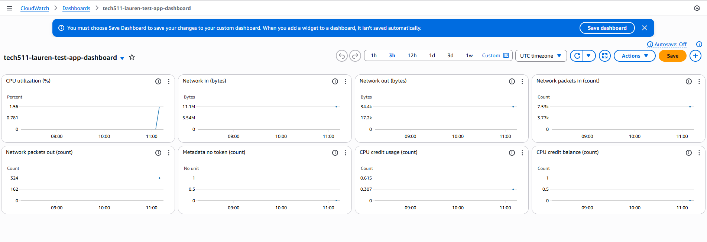

# Monitoring and Alerts Task

- [Monitoring and Alerts Task](#monitoring-and-alerts-task)
  - [1. Setup a Dashboard](#1-setup-a-dashboard)
    - [Steps:](#steps)
  - [2. Create a CPU Usage Alarm](#2-create-a-cpu-usage-alarm)
    - [Steps:](#steps-1)
  - [3. Trigger the Alarm](#3-trigger-the-alarm)
    - [Steps to make your CPU spike:](#steps-to-make-your-cpu-spike)
  - [4. What Happens When The Alarm is Triggered](#4-what-happens-when-the-alarm-is-triggered)
  - [5. Clean Up (Important – avoid costs)](#5-clean-up-important--avoid-costs)


## 1. Setup a Dashboard

### Steps:
1. Go to **AWS Console → CloudWatch → Dashboards**.
2. Click **Create dashboard**.
3. Give it a meaningful name using the naming convention (e.g. `tech511-lauren-sparta-test-dashboard`).
4. Add a **Line widget**.
5. In the widget settings:
   - Choose **Metrics → EC2 → Per-Instance Metrics**.
   - Find your app instance by either typing in, or copying and pasting, your instance id.
   - Select **CPUUtilization** (Ensure you use American spelling).
6. Enable **Detailed Monitoring** on your instance if you have not already enabled:
   - EC2 - Select your instance - Monitoring tab - Enable Detailed Monitoring.
7. Save the widget and your dashboard.



## 2. Create a CPU Usage Alarm

### Steps:
1. In **CloudWatch**, go to **Alarms → All alarms → Create alarm**.
2. Choose **Select metric**.
   - Go to: **EC2 → Per-Instance Metrics → CPUUtilization**.
   - Find your app instance by either typing in, or copying and pasting, your instance id.
3. Define condition:
   - **Threshold type**: Static.
   - **Whenever CPUUtilization is… Greater/Equal** 5 (not sure if it's percent, or something else).
    - Period: 60 seconds.
4. Notifications:
   - Create a new SNS topic (e.g., `lauren-test-alarm`).
   - Enter your email address.
   - Confirm subscription from the email you’ll receive.
5. Name the alarm (e.g., `tech511-lauren-sparta-alarm-test`).
6. Create alarm.

## 3. Trigger the Alarm

### Steps to make your CPU spike:
- SSH into your instance:
  ```bash
  ssh -i ~/.ssh/my-key.pem ubuntu@<public-ip>

- Run something that consumes CPU, for example, updating or upgrading packages, or using Apache Bench.

## 4. What Happens When The Alarm is Triggered

Once CPUUtilization exceeds your threshold, the alarm state changes:

From OK → ALARM.


SNS sends you an email notification.

Screenshot:


## 5. Clean Up (Important – avoid costs)

In CloudWatch → Dashboards → delete your dashboard.

In CloudWatch → Alarms → delete your CPU alarm.

In Instances - stop or terminate your instance.

**All done!**