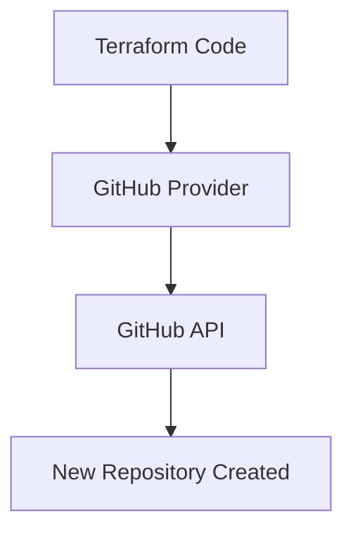

# Creating a GitHub Repository with Terraform

[Creating a GitHub Repository with Terraform](#creating-a-github-repository-with-terraform)  
- [Creating a GitHub Repository with Terraform](#creating-a-github-repository-with-terraform)
  - [Overview](#overview)
  - [Problem We’re Solving](#problem-were-solving)
  - [1. Part One: Provider Configuration](#1-part-one-provider-configuration)
  - [Troubleshooting](#troubleshooting)
  - [Websites Used](#websites-used)

## Overview
This README explains:  
- How I used **Terraform** to provision a **GitHub repository** automatically.  
- Why using Terraform for GitHub repo creation matters.  
- The steps taken to configure the GitHub provider, securely manage authentication, and define the repository resource.  

## Problem We’re Solving
If repositories are created manually through the GitHub web UI:  
- They can be inconsistent in naming, settings, and visibility.  
- Harder to reproduce across environments or teams.  
- No “source of truth” to track why/how the repo was made.  

By creating a repo with **Terraform**:  
- Configuration is **codified** and **repeatable**.  
- Secure storage of tokens ensures good practice.  
- Repo creation is **instant** and **documented** in version control.  

## 1. Part One: Provider Configuration
- Defined the GitHub provider in `main.tf`:  
  ```hcl
  terraform {
    required_providers {
      github = {
        source  = "integrations/github"
        version = "~> 6.0"
      }
    }
  }

  provider "github" {
    token = var.github_token
    owner = "my-github-username"
  }

* Specified the **GitHub owner** (username or organisation).
* Ensured provider downloads correctly with `terraform init`.

<br>

**Why:** Terraform needs to know which provider to use and who owns the repo.  

## 2. Part Two: Variable Setup

* Declared a **sensitive variable** in `variables.tf`:

  ```hcl
  variable "github_token" {
    description = "GitHub Personal Access Token"
    type        = string
    sensitive   = true
  }
  
* Token stored outside of code:

  * As an **environment variable**:

    ```bash
    export TF_VAR_github_token="ghp_xxx..."

  * Or inside `terraform.tfvars` (never committed).

<br>

**Why:** This prevents secrets from being hardcoded in Terraform files.  

## 3. Part Three: Repository Resource

* Added the following resource block:

  ```hcl
  resource "github_repository" "my_repo" {
    name        = "my-terraform-repo"
    description = "This repo was created using Terraform 🚀"
    visibility  = "private"
    has_issues  = true
    has_wiki    = true
    auto_init   = true
  }
  
* Options included:

  * `auto_init = true` to add an initial README.
  * `visibility` set to **private** for security.

<br>

**Why:** This defines the repo itself, including description and visibility.  

## 4. Part Four: Terraform Workflow

* Ran the standard Terraform commands:

  ```
  terraform init
  terraform plan
  terraform apply
  ```
* Verified in the GitHub UI that the new repo existed, as can be seen here: 
<br>
[Link to my repo](https://github.com/laurenksmith/tech511-lauren-tf-created-repo)

<br>

**Why:** This is how Terraform provisions and applies infrastructure changes.  

## Key Takeaways

* Terraform can manage **GitHub resources** as well as cloud infrastructure.
* Using a **PAT** is required (SSH keys won’t work for provider auth).
* Sensitive values are best stored as **environment variables**.
* Repo creation becomes **repeatable, auditable, and secure**.

## Why & Benefits of Managing GitHub with Terraform

### Why We Do It

* Manual repo creation = error-prone and inconsistent.
* Infrastructure as Code (IaC) keeps everything **version-controlled**.
* Ensures naming and settings are applied **exactly the same way every time**.

### Benefits for Me

* Practised using a **new provider** with Terraform.
* Gained confidence in handling **sensitive values** properly.
* Automated repo setup → saves time and mistakes.

### Benefits for the Home Office

* **Consistency** across all repos created for projects.
* **Security-first approach** by avoiding manual misconfigurations.
* **Scalability** — multiple repos can be created automatically for different environments or projects.

## Diagram

Below shows a high-level representation of the workflow:


## Troubleshooting

* **Error: Authentication failed**
  → Ensure PAT is exported as `TF_VAR_github_token`.
* **Repo already exists**
  → Change the `name` value in the `github_repository` block.
* **Token missing scopes**
  → Recreate PAT with `repo` + `admin:repo_hook` scopes.

## Websites Used

* [Terraform GitHub Provider Docs](https://registry.terraform.io/providers/integrations/github/latest)
* [Video explaining how to create a GitHub repo using Terraform](https://registry.terraform.io/providers/integrations/github/latest/docs/resources/repository)
* [GitHub: Creating a Personal Access Token](https://docs.github.com/en/authentication/keeping-your-account-and-data-secure/creating-a-personal-access-token)
* [Terraform Official Documentation](https://developer.hashicorp.com/terraform/docs)

```


laurenksmith/tech511-lauren-tf-created-repo

