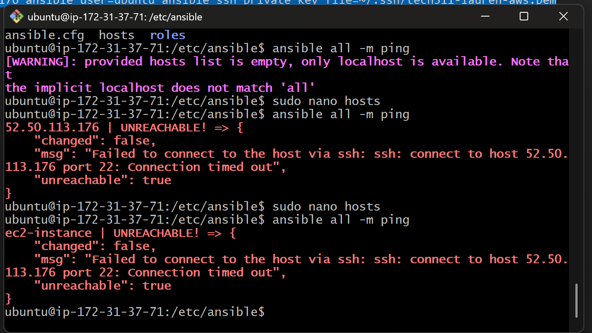

# Ansible

- [Ansible](#ansible)
  - [Introduction to Ansible](#introduction-to-ansible)
    - [What is Ansible?](#what-is-ansible)
    - [How Does it Work?](#how-does-it-work)
  - [Problem We're Solving](#problem-were-solving)
  - [Creating Our First Ansible Instances](#creating-our-first-ansible-instances)
    - [Controller Node](#controller-node)
  - [Why \& Benefits of Managing Nodes with Ansible](#why--benefits-of-managing-nodes-with-ansible)
    - [Why We Do It](#why-we-do-it)
    - [Benefits for Me](#benefits-for-me)
    - [Benefits for the Home Office](#benefits-for-the-home-office)
  - [Troubleshooting](#troubleshooting)
    - [1. Error Message when running the ` ansible all -m ping` command:](#1-error-message-when-running-the--ansible-all--m-ping-command)

## Introduction to Ansible

### What is Ansible?

- A configuration management tool
- Red Hat leads development
- Written in Python
- Started with just a few core modules that managed Linux servers
- Works with almost any system, including:
  - Linux & Windows servers
  - routers and switches
  - Cloud services

### How Does it Work?

- recipe (code)
- Ansible (robot) follows the recipe
- recipes (the actions/tasks/instructions) are written in YAML called 'playbooks' (stored in control node)
- Ansible control node tells the target nodes what to do
- Agentless
  - no need to install Ansible on target nodes
  - instead, using SSH to access target nodes and it also needs Python interpreter on Linux target nodes

## Problem We're Solving

If we configure machines manually every time:
- We risk inconsistent setups and hidden “it-works-on-my-machine” differences.
- It’s harder to reproduce across the cohort or future environments.
- There’s no single source of truth for how/why things were configured.

By creating VMs with Terraform and orchestrating with Ansible:
- Infra and config become codified and repeatable.
- SSH/auth details and inventory are explicit.
- We can verify connectivity quickly and safely with Ansible modules.

## Creating Our First Ansible Instances

### Controller Node

1. First, we started up our controller VM using Terraform commands on Bash.
2. Then, we got our SSH commands from AWS and SSHd in to our controller VMs.
3. From there, we ran the following commands:
    - `sudo apt-get update -y`
    - `sudo DEBIAN_FRONTEND=noninteractive apt-get upgrade -y`
    - `sudo apt-add-repository ppa:ansible/ansible`
    - `sudo apt-get update -y` (not a typo - run it again)
    - `sudo apt install ansible -y`
    - `cd .ssh`
4. Then we copied the contents of our PEM file from our local machine's .ssh folder into a new file in this directory **with the exact same name as the file on our local machine, very important**.
    - run:
      -  `touch <insert name of your pem file here: remember - spelling very nb!>`
      -  `nano <exact same name of the pem file here>`
      -  Paste **all** the contents - exactly as it is in your local machine's file, in this new file.
  5. Once you've saved that (*ctrl s, then ctrl x to exit*), run these 3 commands:
   - `ls -al` (to check that your file is there, and check permissions)
   - `chmod 400 tech511-lauren-aws.pem` to ensure that you, and you alone, have permission to read this file. No one else can even see it.<br>
  **Why**: SSH requires strict key permissions. `chmod 400` prevents accidental edits and stops SSH from rejecting the key.
   - `ls -al` (again - to check that the permissions have updated)
5. Now, run `cd ~/etc/ansible`
6. Next, run the command `sudo nano hosts`, which allows you to **link** your app node to your controller node using the controller's default inventory.
7. Inside this hosts file, you will need to tell your controller where to find your pem key as well as your app's public ip address.
8.  In order to do this, you will need:
    - the name of your pem key file
    - to start your app vm
9.  Once you have the elements in step 9 done, add these 2 lines to the **top** of your hosts file:
    <br>
    ```
    [web]
    ec2-instance ansible_host=<app public ip address here> ansible_user=ubuntu ansible_ssh_private_key_file=~/.ssh/<name of your pem file here>.pem
     ```
  **Why**: The inventory is Ansible's 'address book' and connection settings. It tells Ansible *where* to connect as well as *how* to connect (user + key) <br>
10. ctrl s, ctrl x to save and exit. <br>
11. Now, if everything is working, the following command 'ping' command should work to confirm the connection to your app node.
    - **What is a ping command**?
        A ping command sends a message to a node, and, if the connection is there, a pong command should be returned and printed to your screen!
        <br>

    ` ansible all -m ping`


  **Why**: `-m ping` checks if we can SSH into the node and execute a tiny module. It's the quickest sanity check before doing any *real* work.

## Why & Benefits of Managing Nodes with Ansible
### Why We Do It

- Manual SSHing and one-off bash scripts are error-prone and don’t scale.
- With Ansible, what to change and where to apply it are declarative and visible.
- Combined with Terraform, we get provision → configure as code, end-to-end.

### Benefits for Me

- Clear mental model: Terraform builds, Ansible configures.
- Faster debug loops: inventory + -m ping quickly isolate network/SSH vs config issues.
- Reusable structure for future groups ([db], [controllers], etc.).

### Benefits for the Home Office

- Consistency across environments (same inventory structure, same connection policy).
- Auditability: inventory and Ansible runs are reproducible and version-controlled.
- Scalability: add more target nodes to groups; run the same tasks at scale with confidence.

## Troubleshooting

### 1. Error Message when running the ` ansible all -m ping` command:



This happened to me. There are a few things that might cause this:
1. In your controller's security group, does port 22 allow all traffic?
2. In your app's security group, does port 22 allow all traffic?
3. It might be that you need to use your app's **PRIVATE** ip address rather than the public one.
I had to fix all 3 of these steps, but that did fix it!

